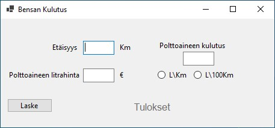

# Funktiot_Bensankulutus

## C#
- [Funktiot-Bensankulutus](https://github.com/Luis93Hub/BensaBudjetti/blob/master/Funktiot_Bensankulutus/Form1.cs)

# Fuel Cost Calculator (C# WinForms) ⛽
[](LICENSE)
[](https://dotnet.microsoft.com/en-us/languages/csharp)
[](https://github.com/Luis93Hub/Funktiot_Bensankulutus)

## 🌟 Project Overview
A Windows Forms application designed for Finnish users to calculate trip fuel costs with precision. 

**Key Highlights:**
- 🇫🇮 Finnish UI localization (suomi)
- ⚡ Dual measurement modes: L/100km (European) and L/km
- 💰 Euro (€) currency formatting

## 🖼️ Application Preview


## 🚀 Features
| Feature | Description |
|---------|-------------|
| 📏 Distance Input | Enter trip distance in kilometers |
| ⛽ Consumption Modes | Toggle between L/100km and L/km |
| 💵 Real-time Calculation | Instant cost results with 2-decimal precision |

## 🛠️ Technical Stack
```plaintext
- Language: C# 10
- Framework: .NET 6 Windows Forms
- IDE: Visual Studio 2022
- Dependencies: None (standalone executable)
